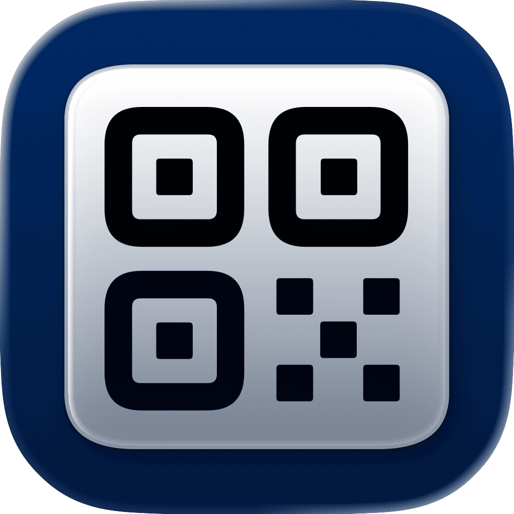

<p align="center">
    
</p>

<p align="center">
    
    
    <a href="https://danielsaidi.github.io/ScanCodes"></a>
    <a href="https://github.com/danielsaidi/ScanCodes/blob/main/LICENSE"></a>
</p>


# ScanCodes

ScanCodes is a Swift library with scan code-related features for SwiftUI, like a ``ScanCode``  and ``CodeScannerView`` that can scan QR and barcodes directly into your app.

<p align="center">
    
</p>


## Installation

ScanCodes can be installed with the Swift Package Manager:

```
https://github.com/danielsaidi/ScanCodes.git
```


## Supported Platforms

ScanCodes supports iOS 15, iPadOS 15, macOS 12, tvOS 15, and visionOS 1.


## Getting Started

To render a scan code in SwiftUI, just add a ``ScanCode`` with the value and type to render:

```swift
struct ContentView: View {

    var body: some View {
        ScanCode(
            value: "123456789", 
            type: .qr, 
            scale: 5,
            rotation: .pi/4
        )
    }
}
```

To add a QR and barcode scanner to your app, that looks for codes to scan, just use the ``CodeScanner`` view: 

```swift
struct ContentView: View {

    @State var code: String?

    var body: some View {
        CodeScannerView(
            code: $code,
            viewfinder: {
                CodeScannerViewfinder()   
            }
        )
    }
}
```

The code scanner and its viewfinder can be customized to great extent. See the documentation for more details.


## Documentation

The online [documentation][Documentation] has more information, articles, code examples, etc.


## Demo Application

The `Demo` folder has a demo app that lets you explore the library.


## Support My Work

You can [become a sponsor][Sponsors] to help me dedicate more time on my various [open-source tools][OpenSource]. Every contribution, no matter the size, makes a real difference in keeping these tools free and actively developed.


## Contact

Feel free to reach out if you have questions, or want to contribute in any way:

* Website: [danielsaidi.com][Website]
* E-mail: [daniel.saidi@gmail.com][Email]
* Bluesky: [@danielsaidi@bsky.social][Bluesky]
* Mastodon: [@danielsaidi@mastodon.social][Mastodon]


## License

ScanCodes is available under the MIT license. See the [LICENSE][License] file for more info.


[Email]: mailto:daniel.saidi@gmail.com
[Website]: https://danielsaidi.com
[GitHub]: https://github.com/danielsaidi
[OpenSource]: https://danielsaidi.com/opensource
[Sponsors]: https://github.com/sponsors/danielsaidi

[Bluesky]: https://bsky.app/profile/danielsaidi.bsky.social
[Mastodon]: https://mastodon.social/@danielsaidi
[Twitter]: https://twitter.com/danielsaidi

[Documentation]: https://danielsaidi.github.io/ScanCodes
[Getting-Started]: https://danielsaidi.github.io/ScanCodes/documentation/scancodes/getting-started
[License]: https://github.com/danielsaidi/ScanCodes/blob/master/LICENSE
